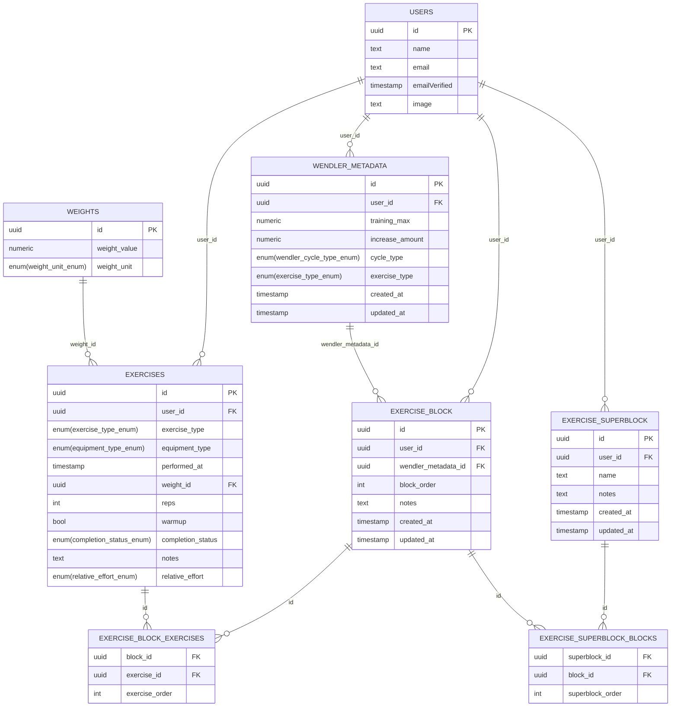

# Database Schema Diagram

Below is a Mermaid ER diagram representing the main tables and relationships in the database, based on the latest migration files:

- PK = Primary Key, FK = Foreign Key
- Enum types are shown for clarity.
- This diagram covers the main tables and their relationships as defined in the migrations.
